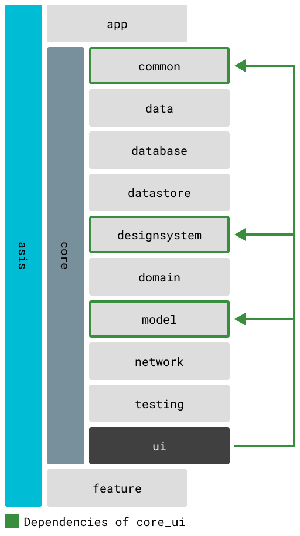
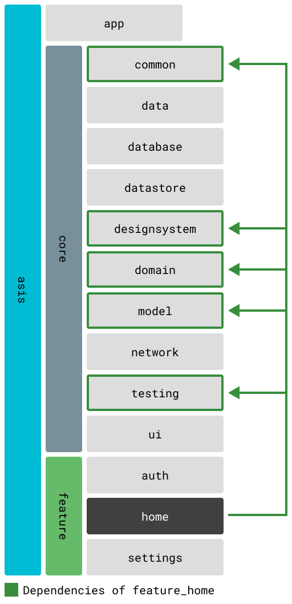
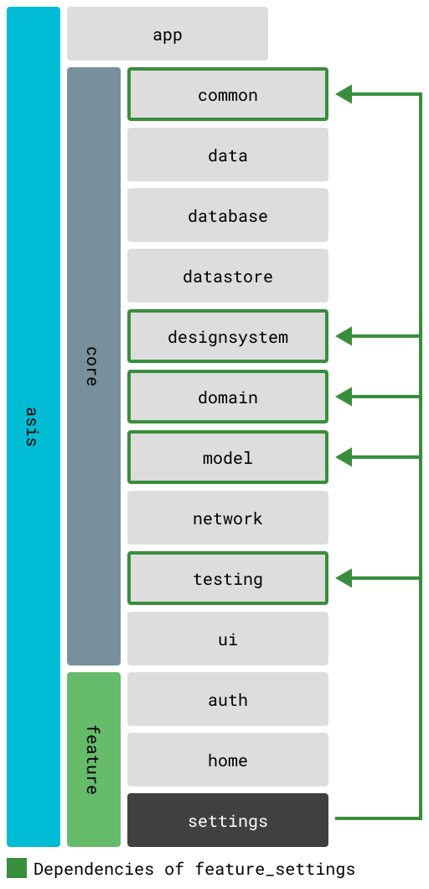

# Module Structure and Dependencies

## Overview

TOBE app uses a modular monorepo structure managed by Melos. Modules are organized into three main categories:
- **App Modules**: Runnable applications
- **Core Modules**: Shared business logic and infrastructure
- **Feature Modules**: Self-contained feature implementations

## Module Dependency Rules

1. **Feature modules** can depend on core modules but not on other features
2. **Core modules** can depend on other core modules following a strict hierarchy
3. **App modules** can depend on both core and feature modules
4. No circular dependencies allowed

## Core Modules

### core/common
Foundation utilities and extensions used across all modules.

**Dependencies**: None (base module)

**Exports**:
- Logging utilities
- Collection extensions
- Result types (Ok/Err pattern)
- Common type aliases


### core/model
Domain models and entities shared across the application.

**Dependencies**: 
- `core/common`

**Exports**:
- Quest models
- User models
- Feed models
- Theme definitions
- Authentication states


### core/network
Network layer with HTTP and GraphQL clients.

**Dependencies**:
- `core/common`
- `core/model`
- `core/network_model`

**Key Features**:
- Dio HTTP client configuration
- GraphQL client setup
- Request/response interceptors
- Error handling


### core/database
Local storage layer using Drift (SQLite).

**Dependencies**:
- `core/common`
- `core/model`

**Features**:
- Database schema definitions
- DAO implementations
- Migration management
- Query builders


### core/datastore
Key-value storage for app preferences.

**Dependencies**:
- `core/common`
- `core/model`

**Stores**:
- Theme preferences
- Agreed version tracking
- User settings


### core/data
Repository pattern implementations bridging domain and infrastructure.

**Dependencies**:
- `core/common`
- `core/model`
- `core/network`
- `core/database`
- `core/datastore`

**Repositories**:
- QuestRepository
- NewsRepository
- UserSettingsRepository
- LegalRepository


### core/domain
Business logic and use cases.

**Dependencies**:
- `core/common`
- `core/model`
- `core/data`
- `core/authenticator`

**Use Cases**:
- Authentication flows
- Quest management
- Feed operations
- Settings management
- Data synchronization


### core/designsystem
Shared UI components and theme definitions.

**Dependencies**:
- `core/common`
- `core/model`

**Exports**:
- Material theme configuration
- Custom widgets
- Design tokens (colors, typography, spacing)
- Brand assets


### core/ui
Reusable UI components with business logic.

**Dependencies**:
- `core/common`
- `core/model`
- `core/designsystem`

**Components**:
- Quest list tiles
- Toast notifications
- Common dialogs



### core/analytics
Analytics abstraction layer.

**Dependencies**:
- `core/common`

**Features**:
- Event tracking interface
- User properties management
- Analytics provider abstraction

### core/authenticator
Authentication service abstraction.

**Dependencies**:
- `core/common`

**Features**:
- Sign in/out operations
- Token management
- User state tracking

## Feature Modules

### feature/auth
Authentication and authorization flows.

**Core Dependencies**:
- `core/common`
- `core/model`
- `core/domain`
- `core/designsystem`
- `core/ui`

**Screens**:
- Sign in
- Sign up
- Password reset
- Profile completion


### feature/home
Main dashboard and app entry point.

**Core Dependencies**:
- `core/common`
- `core/model`
- `core/domain`
- `core/designsystem`
- `core/ui`

**Features**:
- Dashboard overview
- Quick actions
- Navigation hub



### feature/feed
News and content feed.

**Core Dependencies**:
- `core/common`
- `core/model`
- `core/domain`
- `core/designsystem`
- `core/ui`

**Features**:
- News list
- Article details
- Content filtering

### feature/quest
Quest management and tracking.

**Core Dependencies**:
- `core/common`
- `core/model`
- `core/domain`
- `core/designsystem`
- `core/ui`

**Features**:
- Quest list
- Quest details
- Progress tracking
- Quest creation

### feature/settings
User preferences and app configuration.

**Core Dependencies**:
- `core/common`
- `core/model`
- `core/domain`
- `core/designsystem`
- `core/ui`

**Screens**:
- General settings
- Theme selection
- Account management
- About section



### feature/onboarding
First-time user experience.

**Core Dependencies**:
- `core/common`
- `core/model`
- `core/designsystem`

**Features**:
- Welcome screens
- Feature introduction
- Initial setup

### feature/debug
Development and debugging tools (non-production).

**Core Dependencies**:
- `core/common`
- `core/model`
- `core/designsystem`

**Tools**:
- Environment switcher
- Cache inspector
- Log viewer

## App Modules

### app/mobile
Main Flutter mobile application.

**Dependencies**:
- All core modules
- All feature modules
- Platform-specific packages

**Structure**:
```
app/mobile/
├── lib/
│   ├── main.dart          # Entry point
│   ├── app.dart           # App configuration
│   ├── router/            # Navigation setup
│   ├── initializer/       # App initialization
│   └── flavor/            # Flavor configurations
├── ios/                   # iOS platform files
└── android/               # Android platform files
```

### app/backend
GraphQL API server using Dart Frog.

**Dependencies**:
- Selected core modules (network, model, data)
- Server-specific packages

**Structure**:
```
app/backend/
├── lib/
│   ├── graphql/           # Schema and resolvers
│   ├── handler/           # Request handlers
│   └── config/            # Server configuration
├── routes/                # API endpoints
└── main.dart              # Server entry point
```

### app/catalog
Widgetbook component catalog.

**Dependencies**:
- `core/designsystem`
- `core/ui`
- Selected feature UI components

**Purpose**:
- Component documentation
- Interactive playground
- Design system showcase

## Dependency Management

### Adding Dependencies

1. **To a specific module**:
   ```yaml
   # In module's pubspec.yaml
   dependencies:
     package_name: ^1.0.0
   ```

2. **To all modules** (via Melos):
   ```yaml
   # In root pubspec.yaml
   dependencies:
     shared_package: ^1.0.0
   ```

### Updating Dependencies

```bash
# Update all dependencies
melos exec -- flutter pub upgrade

# Update specific package
cd core/model && flutter pub upgrade package_name
```

### Checking Dependencies

```bash
# Analyze dependency graph
melos list --graph

# Check for outdated packages
melos exec -- flutter pub outdated
```

## Module Creation Guidelines

### Core Module Template

```yaml
# pubspec.yaml
name: core_module_name
description: Brief description of module purpose

environment:
  sdk: '>=3.0.0 <4.0.0'

dependencies:
  flutter:
    sdk: flutter
  core_common:
    path: ../common
  # Add other dependencies

dev_dependencies:
  flutter_test:
    sdk: flutter
  build_runner: ^2.4.0
```

### Feature Module Template

```yaml
# pubspec.yaml
name: feature_module_name
description: Feature-specific functionality

environment:
  sdk: '>=3.0.0 <4.0.0'

dependencies:
  flutter:
    sdk: flutter
  # Core dependencies
  core_common:
    path: ../../core/common
  core_model:
    path: ../../core/model
  core_domain:
    path: ../../core/domain
  core_designsystem:
    path: ../../core/designsystem

flutter:
  assets:
    - assets/
```

## Best Practices

### Module Independence
- Each module should have a single, well-defined purpose
- Minimize dependencies between modules
- Use dependency injection for loose coupling

### Public API Design
- Export only necessary classes/functions
- Use barrel exports in main module file
- Document public APIs

### Testing
- Each module should have its own test suite
- Mock dependencies in tests
- Maintain high test coverage

### Version Management
- Keep dependencies up-to-date
- Use exact versions for critical dependencies
- Document breaking changes