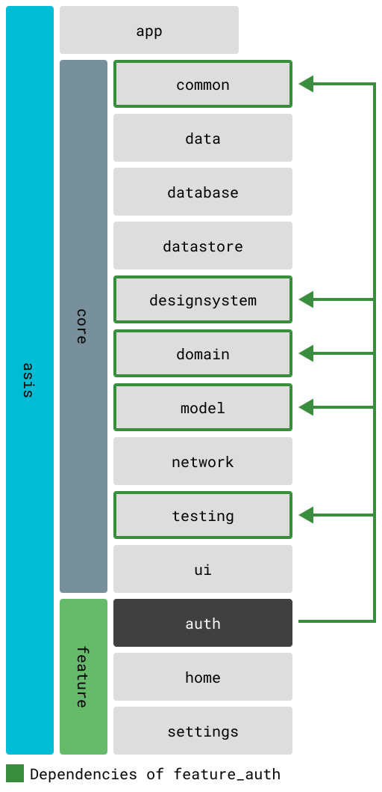

# feature_auth

Authentication and authorization feature module for TOBE app.

## Overview

This package provides complete authentication flows including sign-in, sign-up, password reset, and profile completion. It features a visually appealing video background and integrates with Firebase Authentication.

## Core Dependencies

- `core_common` - Foundation utilities and extensions
- `core_designsystem` - Shared UI components and theme
- `core_domain` - Authentication use cases and business logic
- `core_model` - Authentication state and user models
- `core_ui` - Common UI components

## Screens and Components

### Screens
- **AuthScreen** - Main authentication screen with sign-in form
  - Video background view for enhanced visual experience
  - Sign-in form with email/password validation

### Components
- **SignInForm** - Email and password input form with validation
- **VideoBackgroundView** - Looping video player for background animation

## Navigation and Routing

The auth feature is accessible via:
- Route: `/auth`
- GoRoute: `AuthRoute`
- Navigation: Redirects to `HomeRoute` on successful login

## State Management

This feature uses Riverpod for state management:
- Authentication state is managed through `core_domain` use cases
- Form validation state is handled locally within components
- User session state is persisted via authenticator service

## Localization

The feature includes full internationalization support:
- Localization files: `lib/src/gen/l10n/`
- Supported languages: English (en), Japanese (ja)
- Access via: `FeatureAuthL10n.of(context)`

## Assets

- **Videos**: Background hero video located in `assets/videos/`

## Dependency Graph

For more details on module dependencies, see [Module Structure and Dependencies](../../docs/modules.md).

## Development

To work on this feature:
1. Ensure all core dependencies are built: `melos bs`
2. Generate localization files: `melos gen:l10n`
3. Run tests: `melos test --scope="feature_auth"`