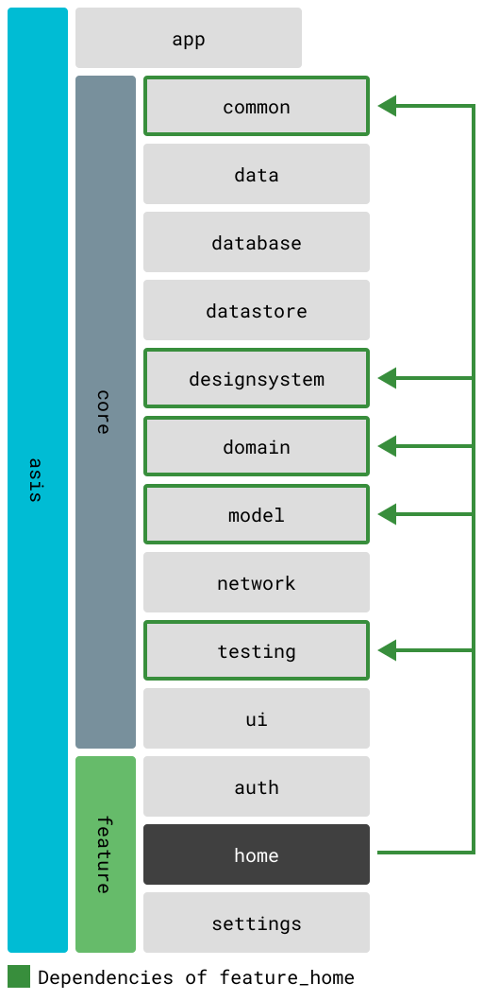

# feature_home

Main dashboard and app entry point for TOBE app.

## Overview

The home feature serves as the central hub of the application, providing users with a dashboard overview of their quests, quick actions for creating new quests, and navigation to other features. It displays quest statistics, recent activities, and serves as the primary landing screen after authentication.

## Core Dependencies

- `core_common` - Foundation utilities and extensions
- `core_designsystem` - Shared UI components and theme
- `core_domain` - Quest and user-related use cases
- `core_model` - Quest and user models
- `core_ui` - Common UI components (quest tiles, etc.)

## Screens and Components

### Screens
- **HomeScreen** - Main dashboard screen
  - Quest overview with statistics
  - Recent quest activities
  - Quick action buttons
  - Navigation to other features

### Dialogs
- **QuickAddQuestDialog** - Streamlined quest creation dialog
  - Title and description input
  - Priority selection
  - Quick save functionality

### Components
- **QuestOverviewSection** - Displays quest statistics and progress
- **RecentQuestListSection** - Shows recently updated or created quests

## Navigation and Routing

The home feature is the default landing page:
- Route: `/` (root)
- GoRoute: `HomeRoute`
- Navigation: Central hub with access to all major features
- Bottom navigation: First tab in the navigation bar

## State Management

Using Riverpod for reactive state management:
- Quest statistics are fetched via `core_domain` providers
- Recent quests are managed through repository patterns
- Real-time updates for quest counts and progress
- Quick add dialog state handled locally

## Localization

Full internationalization support included:
- Localization files: `lib/src/gen/l10n/`
- Supported languages: English (en), Japanese (ja)
- Access via: `FeatureHomeL10n.of(context)`

## Features

- **Dashboard Overview**: Visual representation of quest progress and statistics
- **Quick Actions**: Fast access to create new quests without navigating away
- **Recent Activities**: Stay updated with the latest quest modifications
- **Navigation Hub**: Easy access to all app features from one place

## Dependency Graph

For more details on module dependencies, see [Module Structure and Dependencies](../../docs/modules.md).

## Development

To work on this feature:
1. Ensure all core dependencies are built: `melos bs`
2. Generate localization files: `melos gen:l10n`
3. Run tests: `melos test --scope="feature_home"`
4. Test navigation flow from auth to home screen
