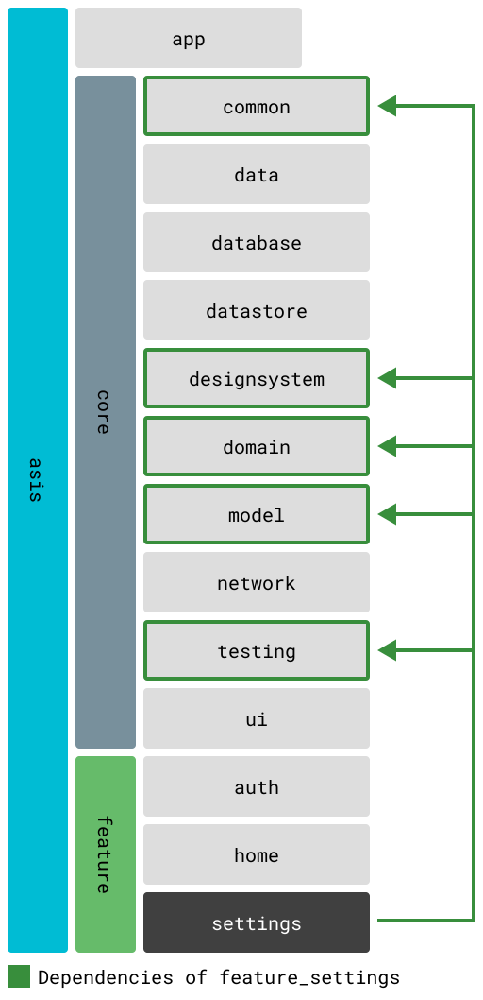

# feature_settings

User preferences and app configuration feature for TOBE app.

## Overview

The settings feature provides a centralized location for users to manage their app preferences, account settings, and view app information. It includes theme customization, notification preferences, account management, and access to legal documents. The feature emphasizes user control and transparency.

## Core Dependencies

- `core_common` - Foundation utilities and extensions
- `core_designsystem` - Shared UI components and theme
- `core_domain` - User settings and preferences use cases
- `core_model` - Settings and configuration models
- `core_ui` - Common UI components

## Screens and Components

### Screens
- **SettingsScreen** - Main settings dashboard
  - Theme configuration
  - Account management
  - App information
  - Legal documents access
  - Sign out functionality

- **ThemeSettingDialogScreen** - Theme selection dialog
  - Light/Dark/System theme options
  - Real-time preview
  - Persistence of selection

### Components
- **ThemeListTile** - Theme selection tile with current theme indicator
- **AppConfigTileContent** - Displays app version and build information

## Navigation and Routing

Settings feature navigation:
- Main: `/settings`
- Theme Dialog: Presented as modal dialog
- GoRoute: `SettingsRoute`
- Bottom navigation: Fourth tab in the navigation bar
- Sub-navigation: Links to auth, legal, and other features

## State Management

Using Riverpod for reactive preferences:
- Theme preference state with persistence
- User settings synchronized with datastore
- Account state from authentication provider
- Real-time UI updates on preference changes

## Localization

Full internationalization support:
- Localization files: `lib/src/gen/l10n/`
- Supported languages: English (en), Japanese (ja)
- Access via: `FeatureSettingsL10n.of(context)`

## Features

### Appearance
- **Theme Selection**: Light, Dark, or System default
- **Dynamic Theming**: Instant UI updates without restart

### Account
- **User Profile**: Display current user information
- **Sign Out**: Secure logout with session cleanup

### App Information
- **Version Info**: Current app version and build number
- **Legal Documents**: Terms of service, privacy policy
- **Licenses**: Open source licenses viewer

### Developer Options
- **Debug Mode**: Access to debug features (dev builds only)
- **Environment Info**: Current flavor and API endpoints

## Data Persistence

Settings are persisted using:
- `core_datastore` for theme preferences
- `core_domain` for user-specific settings
- SharedPreferences for quick access

## Dependency Graph

For more details on module dependencies, see [Module Structure and Dependencies](../../docs/modules.md).

## Development

To work on this feature:
1. Ensure all core dependencies are built: `melos bs`
2. Generate localization files: `melos gen:l10n`
3. Run tests: `melos test --scope="feature_settings"`
4. Test theme changes across app restart
5. Verify deep links to sub-features work correctly